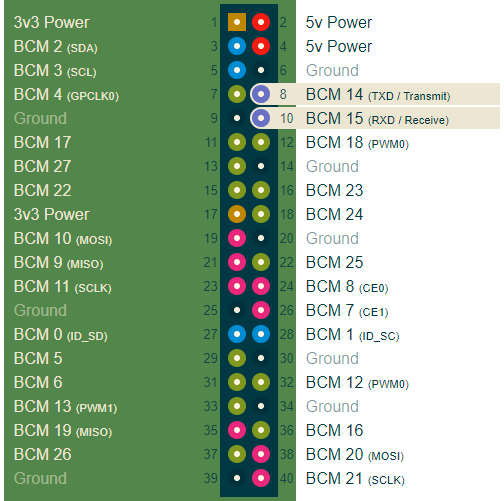

# Laboratorijska vježba 2: Serijski interfejsi bazirani na UART interfejsu #

## Ciljevi i ishodi ##
Osnovni cilj vježbe je da se student upozna sa osnovnim parametrima UART interfejsa i serijskog porta, kao i da nauči da interpretira talasne oblike na osciloskopu sa serijskog UART interfejsa.

Po završetku vježbe, student će biti sposoban da:

- podesi parametre UART interfejsa u okviru Linux konzole,
- šalje podatke na UART interfejs iz Linux konzole,
- prikazuje podatke primljene sa UART interfejsa u Linux konzoli,
- interpretira talasne oblike na osciloskopu dobijene sa UART interfejsa.

## Priprema za vježbu ##
Očekuje se da je student upoznat sa teorijskim osnovama i principom rada UART interefejsa (kroz prezentacije na predavanjima i konsultovanje dostupne literature), koji predstavlja osnovu serijskog porta u računarskim sistemima.

Prije početka vježbe, student treba da ažurira stanje lokalnog repozitorijuma izvršavanjem `git pull` komande u okviru `~/ikm-labs/` direktorijuma. Ako repozitorijum nije ranije preuzet, potrebno ga je klonirati u lokalnom `home` direktorijumu korišćenjem naredbe `git clone https://github.com/knezicm/ikm-labs`. Nakon što je repozitorijum ažuriran/kloniran, potrebno je kopirati folder `labs` sa cijelim  njegovim sadržajem u `home` direktorijum trenutnog korisnika.

## Aktiviranje UART interfejsa na ciljnoj platformi ##
*Raspberry Pi* platforma posjeduje hardverski UART interfejs čiji se prijemni (RX) i predajni (TX) pinovi nalaze na GPIO konektoru na pozicijama BCM14 i BCM15, respektivno, kao što može da se vidi na slici (izvor: [Raspberry Pi Pinout](https://pinout.xyz/)).



U okviru Linux operativnog sistema, ovom interfejsu se može pristupati preko virtuelnog fajla `/dev/ttyAMA0`. *Raspbian* operativni sistem podrazumijevano rezerviše ovaj hardverski UART modul za sistemsku konzolu preko koje se može pristupati resursima operativnog sistema u cilju debagovanja. Ovo onemogućava korišćenje UART interfejsa za potrebe korisnika. Prema tome, prvo je potrebno provjeriti da li je port već zauzet (odnosno, da li je sistemska konzola omogućena na ovom portu) i, ako jeste, u podešavanjima operativnog sistema onemogućiti je kako bi serijski port bio dostupan.

Status sistemske konzole na hardverskom UART modulu provjeravamo komandom:

```
dmesg | grep tty
```

**Napomena:** Prethodnu komandu je potrebno pokrenuti na ciljnoj platformi (*Raspberry Pi*), a ne na razvojnoj platformi (PC računar sa *Ubuntu* operativnim sistemom na virtuelnoj mašini).

Ova komanda prikazuje sve terminalne uređaje (`tty`) registrovane u operativnom sistemu (uključujući i hardverski UART interfejs), kao i njihovo stanje po pitanju sistemske konzole. Potrebno je potražiti liniju u kojoj piše da je konzola omogućena (*console enabled* na terminalnom uređaju `/dev/ttyAMA0`). Ako ove linije nema, to znači da konzola nije omogućena na ovom interfejsu i nije potrebno modifikovati konfiguraciju. Ako linija postoji, potrebno je onemogućiti konzolu u okviru sistemskih podešavanja kojima se pristupa komandom:

```
sudo raspi-config
```

Komanda pokreće konfiguracioni program sa ponuđenim različitim opcijama. U našem slučaju, potrebno je odabrati opciju *Interfacing Options*, a zatim *P6 Serial*. U okviru ponuđenih pitanja, potrebno je odabrati opciju za onemogućenje (*Disable*) konzole na serijskom portu i omogućenje (*Enable*) serijskog porta. Konačno, podešavanja treba sačuvati i izaći iz konfiguracionog menija (opcija *Finish*). Pri izlasku, operativni sistem će zahtjevati restartovanje, što treba potvrditi. Nakon restartovanja platforme, na prethodno opisani način, može se potvrditi da sistemska konzola više nije omogućena na hardverskom UART interfejsu.

**Napomena:** Ukoliko se kao ciljna platforma koristi *Raspberry Pi 3*, neophodno je onemogućiti *bluetooth* modul koji se podrazumijevano povezuje na `/dev/ttyAMA0` serijski port. U tu svrhu, potrebno je dodati sljedeću liniju na kraj fajla `/boot/config.txt`:

```
dtoverlay=pi3-disable-bt
```

## Podešavanje parametara serijskog porta ##
U Linux operativnom sistemu, trenutna podešavanja serijskog porta u okviru konzole, mogu se prikazati komandom:

```
stty -F /dev/ttyAMA0 -a
```

Opcija `-F` definiše naziv virtuelnog fajla serijskog porta čija podešavanja želimo da prikažemo, dok opcijom `-a` prikazujemo sva podešavanja. Detaljnije informacije o komandi možemo da dobijemo komandom `man stty`.

Tako, na primjer, ako želimo da promijenimo bitsku brzinu u man stranici komande možemo da vidimo da je potrebno koristiti sljedeći format `stty` komande:

```
stty -F /dev/ttyAMA0 N
```
gdje je `N` broj koji definiše bitsku brzinu.

Ostale opcije u okviru komande, uglavnom se odnose na uključenje i isključenje različitih opcija kojima podešavamo parametre terminala, UART interfejsa ili serijskog porta. Opcija se uključuje navođenjem njenog imena, a isključuje navođenjem imena opcije ispred kojeg se stavlja znak manje (`-`). Na primjer, ako želimo da uključimo slanje bita parnosti, a isključimo eho, koristimo sljedeću komandu

```
stty -F /dev/ttyAMA0 parenb -echo
```

Kao što možemo da vidimo iz primjera prethodne komande, jednom komandom je moguće uključiti/isključiti više opcija istovremeno. Preporuka je da student posveti određeno vrijeme proučavanju različitih opcija i eksperimentisanju sa istim, kako bi se što više srodio sa ovom korisnom alatkom.

## Slanje i prijem podataka ##
Kao što je već poznato, svi uređaji u *Linux* operativnom sistemu se vide kao fajlovi. Prema tome, da bi poslali podatke na serijski port iz konzole, potrebno je koristiti *Linux* operator za redirekciju (`>`), pri čemu se na standardni izlaz šalje podatak pomoću `echo` komande.

```
echo "Baba Vanga" > /dev/ttyAMA0
```

U komandi iznad, string `Baba Vanga` koji bi se `echo` komandom inače prikazivao na standardnom izlazu, preusmjerava se na virtuelni fajl `/dev/ttyAMA0`, koji efektivno šalje karaktere na serijski port, odnosno UART interfejs u konkretnom slučaju. Važno je napomenuti da se string koji sadrži razmake specificira unutar jednostrukih ili dvostrukih navodnika. Komadna `echo` može da primi i dodatne opcije, kao na prijmer, `-n` kojom se iz datog stringa izostavlja sekvenca za novi red (*newline*), ili `-e` koja omogućava interpretaciju specijalnih znakova koji su označeni *backslash* karakterom (korisno kod slanja podataka u heksadecimalnoj notaciji). Na primjer, ako želimo da pošaljemo heksadecimalni broj 0x1234, koristimo sljedeću komandu:

```
echo -n -e '\x12\x34' > /dev/ttyAMA0
```

Čitanje podatka sa serijskog porta obavlja se na sličan način, čitanjem sadržaja fajla. To se, na primjer, može postići komandom `cat`:

```
cat /dev/ttyAMA0
```

Ovdje je potrebno napomenuti da će komanda `cat` blokirati pristup terminalu i da se neće ništa prikazati sve dok se u prijemnom baferu ne primi podatak preko prijemne signalne linije UART interfejsa.

## Podešavanje osciloskopa ##
S obzirom da je svaki karakter kod UART prenosa počinje start bitom (nizak logički nivo), triger sistem osciloskopa treba podesiti tako da se obezbijedi zamrzavanje stanja na displeju (tzv. *single mode*) pri detekciji opadajuće ivice na signalnoj liniji. Posebnu pažnju obratiti na podešavanje vertikalne i horizontalne skale osciloskopa, koji treba da odgovaraju naponskim nivoima interfejsa i podešenoj bitskoj brzini, kao i na ostala relevantna podešavanja kanala i sonde (uključeno slabljenje, nivo trigera i sl.).

## Zadaci za samostalnu izradu ##

### Zadatak 1: Osnovno podešavanje parametara, slanje bajta i interpretacija poslanog podatka na osciloskopu ###

U zadatku je potrebno uraditi sljedeće:

1. Podesiti parametre UART interfejsa na ciljnoj platformi tako da se šalju 8-bitni podaci brzinom 19200 bps, bez parnosti i sa jedni start i jednim stop bitom.

2. Priključiti sondu osciloskpa tako da se posmatra signal na predajnoj (TX) liniji UART interefejsa na ciljnoj platformi.

3. Poslati podatak 0x55 i uhvatiti njegov izgled na osciloskopu. Analizirati dobijeni talasni oblik i potvrditi da se šalje definisani podatak sa podešenom bitskom brzinom. Identifikovati start i stop bite.

4. Promijeniti bitsku brzinu na 4800 i poslati podatak 0x12. Ponoviti sve iz prethodne tačke.

### Zadatak 2: Napredno podešavanje UART interfejsa sa slanjem i prijemom podataka ###

U zadatku je potrebno uraditi sljedeće:

1. Podesiti parametre UART interfejsa na ciljnoj platformi tako da se šalju 8-bitni podaci brzinom 9600 bps, bez parnosti i sa jedni start i jednim stop bitom.

2. Napraviti hardversku *loopback* konekciju na ciljnoj platformi (povezati RX i TX pin).

3. U jednom terminalu slati podatke pomoću `echo` komande.

4. U drugom terminalu verifikovati primljene podatke pomoću `cat` komande.

5. Otkloniti problem beskonačne petlje na prijemnoj strani odgovarajućim podešavanjem parametara serijskog porta.
