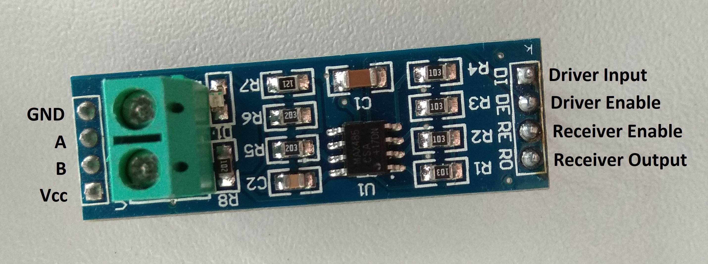
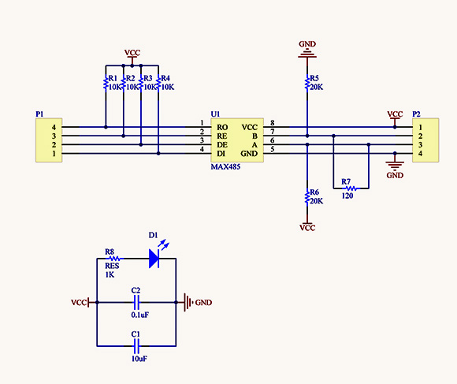

# Laboratorijska vježba 3: Protokoli fizičkog sloja UART interfejsa #

## Ciljevi i ishodi ##
Osnovni cilj vježbe je da student savlada programski interfejs za serijski port u *Linux* operativnom sistemu, kao i da se upozna sa praktičnim aspektima protokola na fizičkom sloju UART interfejsa.

Po završetku vježbe, student će biti sposoban da:

- parametrizuje i razmjenjuje podatke preko UART interfejsa korišćenjem *Linux* programskog interfejsa,
- poveže komponente fizičkog sloja tako da se formira jednostavna RS-485 mreža,
- obezbijedi programsku podršku koja omogućuje razmjenu podataka između dva čvora u RS-485 mreži.

## Priprema za vježbu ##
Očekuje se da je student upoznat (kroz prezentacije na predavanjima i konsultovanje dostupne literature) sa funkcijama programskog interfejsa serijskog porta u *Linux* operativnom sistemu, kao i sa osnovnim karakteristikama komponenata fizičkog sloja UART interfejsa. Osim toga, student bi trebalo da je upoznat sa korišćenjem i opcijama komande `stty` za podešavanje parametara serijskog porta u *Linux* konzoli.

Prije početka vježbe, student treba da ažurira stanje lokalnog repozitorijuma izvršavanjem `git pull` komande u okviru `~/ikm-labs/` direktorijuma. Ako repozitorijum nije ranije preuzet, potrebno ga je klonirati u lokalnom `home` direktorijumu korišćenjem naredbe `git clone https://github.com/knezicm/ikm-labs`. Nakon što je repozitorijum ažuriran/kloniran, potrebno je kopirati folder `lab3` sa cijelim  njegovim sadržajem u `home` direktorijum trenutnog korisnika.

## Programski interefejs serijskog porta (termios API) ##
U *Linux* operativnom sistemu, za kontrolu rada serijskog porta koristi se *termios API* programski interfejs. U osnovi, to je programski interfejs kojim se u UNIX baziranom operativnom sistemu omogućava pristup terminalnom uređaju. Osnovni koncept se ogleda u tome da se svi uređaji vide kao virtuelni fajlovi, u konkretnom slučaju `/dev/ttyAMA0`, kojima se pristupa standardnim funkcijama i sistemskim pozivima za manipulaciju fajlovima.

Da bi mogli da pristupimo nekom fajlu, potrebno je prvo da ga otvorimo. U tu svrhu koristimo sistemski poziv `open()`. U primjeru serijskog porta, fajl se otvara na sljedeći način:

```
int fd;
...
fd = open("/dev/ttyAMA0", O_RDWR | O_NOCTTY | O_NDELAY);
if (fd < 0)
	fprintf(stderr, "Failed to open serial port. Check if it is used by another device.\n");
```

gdje `fd` predstavlja promjenljivu tipa `int` u kojoj se nalazi *file descriptor* fajla koji otvaramo. Ukoliko je ova vrijednost negativna, to znači da je došlo do neke greške pri otvaranju fajla. Prilikom poziva `open()` funkcije, mogu se proslijediti različite opcije kojima se bliže definiše način pristupa fajlu. Tako, na primjer, opcijom `O_RDWR` omogućavamo pristup fajlu sa čitanjem/upisom. Opcijom `O_NOCTTY` se onemogućava da serijski port postane kontrolni terminal procesa koji ga je otvorio, dok opcijom `O_NDELAY` omogućavamo neblokirajući režim rada operacija koje se koriste pri radu sa serijskim portom. Više informacija o ostalim dostupnim opcijama se može pronaći na man stranici [`open()`](http://man7.org/linux/man-pages/man2/open.2.html) sistemskog poziva. Funkcija `frpintf()` je ista kao standardna `printf()` funkcija s tom razlikom da joj se, kao prvi argument, prosljeđuje *file descriptor* fajla u koji se upisuje formatirani string (u konkretnom slučaju, to je `stderr`, tj. *standard error*).

Podaci se šalju i primaju preko serijskog porta korišćenjem `write()` i `read()` sistemskih poziva. Obje funkcije zahtijevaju da im se proslijedi *file descriptor* otvorenog vrituelnog fajla serijskog porta, pokazivač na bafer u kojem se nalaze podaci koje treba poslati, odnosno u koji će se upisati primljeni podaci i broj bajtova. Funkcija vraća broj uspješno poslatih/primljenih bajtova, odnosno negativnu vrijednost ako se desi greška. Dio koda kojim se razmjenjuju podaci preko serijskog porta (softverska *loopback* veza) ima sljedeći izgled:

```
unsigned char  buffer = 's';
...
while (1)
{
	// software loopback
	if (read(fd, &buffer, 1) > 0)
		write(fd, &buffer, 1);
}
```

Po završetku rada sa serijskim portom, fajl je potrebno zatvoriti sistemskim pozivom `close()` kojoj se prosljeđuje *file descriptor* datog fajla:

```
close(fd)
```

Važno je napomenuti da korišćenje prethodnih funkcija zahtjeva uključivanje određenih sistemskih *header* fajlova u kojima su definisani prototipi datih funkcija. S tim u vezi, u zaglavlju programa, treba da se nalaze sljedeće direktive:

```
#include <stdio.h>
#include <fcntl.h>
#include <unistd.h>
```

Sve prethodno bazira se na standardnim funkcijama i sistemskim pozivima *Linux* operativnog sistema i ne zahtjeva poseban programski interfejs serijskog porta. Međutim, ako želimo da konfigurišemo različite opcije i parametere serijskog porta, odnosno UART interfejsa (npr. bitsku brzinu), potrebno je da koristimo poseban set funkcija i specifične strukture podataka. Programski interfejs *termios API* nudi skup funkcija za podešavanje parametara serijskog porta. Neke od tih funkcija su sljedeće:

|Funkcija|Opis|
|--------|----|
|`tcgetattr()`|Pribavlja trenutne parametre uređaja|
|`tcsetattr()`|Postavlja definisane parametre uređaja|
|`cfgetispeed()`|Pribavlja trenutno podešenu bitsku brzinu prijemne linije|
|`cfgetospeed()`|Pribavlja trenutno podešenu bitsku brzinu predajne linije|
|`cfsetispeed()`|Postavlja bitsku brzinu prijemne linije|
|`cfsetospeed()`|Postavlja bitsku brzinu predajne linije|
|`cfmakeraw()`|Podešava terminal tako da radi u tzv. "sirovom" modu|
|`tcdrain()`|Čeka dok se ne isprazni predajni bafer|
|`tcflow()`|Suspenduje slanje i prijem podataka dok se ne ispuni definisani uslov|
|`tcflush()`|Odbacuje sve neobrađene podatke u baferima|
|`tcsendbrak()`|Generiše *break* signal na predajnoj liniji|

Većina prethodno navedenih funkcija kao argument očekuje pokazivač na `termios` strukturu podataka, koja sadrži sljedeća polja:

```
tcflag_t c_iflag;   /* input modes */
tcflag_t c_oflag;   /* output modes */
tcflag_t c_cflag;   /* control modes */
tcflag_t c_lflags;  /* local modes */
cc_t c_cc[NCCS];    /* special characters */
```

Flegovi u okviru pojedinih polja iz `termios` strukture odgovaraju opcijama koje prihvata `stty` komanda sa kojom su se studenti upoznali u prethodnoj vježbi.

Za više informacija o dostupnim funkcijama i opcijama, preporučuje se da studenti pažljivo prouče [`termios`](http://man7.org/linux/man-pages/man3/termios.3.html) man stranicu.

Primjer podešavanja serijskog porta ima sljedeći izgled:

```
struct termios config;
...
tcgetattr(fd, &config); // get current config
cfmakeraw(&config); // set raw serial communication
config.c_cc[VMIN] = 1; // at least 1 char threshold
config.c_cc[VTIME] = 0; // no timeout
cfsetispeed(&config, B9600); // set receiver baudrate to 9600
cfsetospeed(&config, B9600); // set transmitter baudrate to 9600
tcsetattr(fd, TCSANOW, &config); // update the config
...
```

Parametar `VMIN` označava minimalan broj potrebnih karaktera u baferu da `read()` sistemski poziv vrati vrijednost veću od nula. Parametar `VTIME` definiše *timeout* interval u decisekundama koji će `read()` sistemski poziv čekati da se ispuni uslov o broju potrebnih karaktera u baferu. Opcija `TCSANOW` obezbjeđuje da se željena podešavanja aktuelizuju bez odgode.

Da bi mogli koristiti *termios API*, u zaglavlju fajla je neophodno dodati sljedeću direktivu:

```
#include <termios.h>
```

## wiringPi biblioteka ##
[*wiringPi*](http://wiringpi.com/) biblioteka omogućava programski pristup *Raspberry Pi* periferijama. U našem slučaju, ovu biblioteku ćemo koristiti kada je potrebno manipulisati digitalnim ulazima i izlazima preko GPIO (*General Purpose Input Output*) kontrolera. Da bi mogli da je koristimo, biblioteku je potrebno preuzeti i kroskompajlirati, a zatim dinamički linkovati sa našim programom.

Najlakši način za preuzimanje izvornog koda *wiringPi* biblioteke je da kloniramo njen repozitorijum sljedećom komandom:

```
git clone --depth 1 git://git.drogon.net/wiringPi
```

a zatim je kroskompajliramo tako što pređemo u folder `/path/to/wiringPi/wiringPi` i pokrenemo komandu:

```
make CC=arm-linux-gnueabihf-gcc
```

**Napomena:** Dinamička biblioteka dobijena nakon kroskompajliranja osim ekstenzije `.so` sadrži i broj verzije biblioteke, koji treba odstraniti iz naziva fajla kako bi pri kroskompajliranju i dinamičkom linkovanju našeg programa biblioteka bila vidljiva.

Sada se ova biblioteka može koristiti u našim programima. Važno je napomenuti da je fajl dinamičke biblioteke potrebno prebaciti na ciljnu platformu u neki od sistemskih direktorijuma za čuvanje biblioteka (npr. `/usr/lib`). Za pristup ovim folderima, neophodne su administratorske privilegije pa se za prenos koristi komanda:

```
scp /path/to/wiringPi/lib/libwiringPi.so root@192.168.23.xxx:/usr/lib
```

gdje `xxx` označava dio IP adrese koji je jedisntven za svaki *Raspberry Pi*.

## Povezivanje RS-485 mreže ##
RS-485 je poludupleksna *multipoint* mreža u formi magistrale na koju paralelno može da se poveže do 32 čvora sa jediničnim opterećenjem (*unit load*). Magistrala mora da bude terminisana na oba kraja otpornikom čija je otpornost jedaka karakterističnoj impendansi voda (120 oma u slučaju upredene parice), kako bi se izbjegla refleksija signala.

Na fizičkom sloju RS-485 mreže, koriste se komponente pod nazivom transiveri, čija je uloga da digitalni signal koji dolazi sa UART interfejsa nekog mikrokontrolera prevede u diferencijalni signal u skladu sa specifikacijama starndarda. Najčešće korišćeni transiveri su MAX-485 za slučaj kada se koristi napajanje od 5V, odnosno SN75HVD12 ako je napajanje 3.3V. Iako je za *Raspberry Pi* pogodnija druga opcija, u ovoj vježbi je na raspolaganju modul koji kao transiver koristi MAX-485. Izgled samog modula je dat na slici ispod.



Pin DI (*Driver Input*) predstavlja digitalni ulaz transivera koji se povezuje sa predajnom linijom UART interfejsa (TX). Pin RO (*Receiver Output*) je izlazni pin koji je potrebno dovesti na prijemnu liniju UART interfejsa (RX). Pinovi DE (*Driver Enable*) i RE (*Receiver Enable*) služe za omogućenje slanja i prijema podatka, respektivno. Iako su ovo dva nezavisna pina, u praksi se obično kratko spajaju tako da se transiver postavlja u režim predajnika dovođenjem visokog logičkog nivoa, odnosno u režim prijemnika kada se dovede nizak logički nivo na ova dva pina.

Električna šema datog modula, data je na sljedećoj slici (preuzeta sa sljedećeg [izvora](http://www.yourduino.com/sunshop/index.php?l=product_detail&p=323)).



S obzirom da ovaj modul koristi napajanje od 5V i da digitalni ulazi/izlazi koriste očekuju, odnosno daju 5V pri visokom logičkom nivou, direktno spajanje ovog modula sa pinovima na *Raspberry Pi* platformi nije dozvoljeno. Stoga je nephodno **obavezno** koristiti posebno kolo za prilagođavanje napona sa 5V na 3.3V (npr. [3.3V-5V Voltage Translator](https://www.mikroe.com/33v-5v-voltage-translator-board) kompanije Mikroelektronika) ili na neki drugi način zaštiti ulazne pinove *Rasberry Pi* platforme (npr. serijskim vezivanjem otpornika otpornosti koja je veća ili jednaka 2k).

## Zadaci za samostalnu izradu ##

**Važne napomene:** Zadaci se zbog specifičnosti i ograničenja po pitanju dostupne opreme rade u paru, tj. dva studenta koja sjede jedan pored drugog trebaju zajedno da realizuju zadatak. Izmjene koje je potrebno napraviti u datom izvornom kodu, označene su sa `TODO` u okviru linija sa komentarima.

### Zadatak 1: Programsko podešavanje parametara i razmjena podataka preko UART interfejsa ###

U zadatku je potrebno uraditi sljedeće:

1. Dopuniti polazni izvorni kod `serial.c`, koji se nalazi u folderu `lab3-1`, tako da se omogući pristup UART interfejsu na *Raspberry Pi* platformi sa *raw* načinom rada i 19200 bitskom brzinom.

2. Povezati RX pin jedne *Raspberry Pi* platforme sa TX pinom druge *Raspberry Pi* platforme i obrnuto.

**Napomena:** Nemojte zaboraviti povezati mase ove dvije platforme.

3. Kroskompajlirati dati program i prenijeti dobijeni izvršni fajl na obje platforme, a zatim pokrenuti izvršavanje programa na obje platforme.

4. Verifikovati ispravnost rada u skladu da logikom programa opisanom datim izvornim kodom. Prekinuti izvršavanje programa `Ctrl+C` kombinacijom.

5. Promijeniti kod tako da program sam prekine izvršavanje bez `Ctrl+C` kombinacije.

### Zadatak 2: Povezivanje i testiranje jednostavne RS-485 mreže ###

U zadatku je potrebno uraditi sljedeće:

1. Povezati dvije *Raspberry Pi* platforme sa datim RS-485 modulima. Predajnu UART liniju (TX) treba povezati sa DI linijom modula, dok prijemnu UART liniju (RX) treba povezati sa RO linijom modula. Liniju za omogućenje predajnika (žica označena sa TE) treba povezati sa pinom BCM17 (WiringPi 0) na konektoru. Važno je napomenuti da je linija za omogućenje prijemnika kratko spojena sa TE linijom na protobordu.

**Napomena:** Sve linije treba da se povežu preko *3.3V-5V Voltage Translator* modula. Posebnu pažnju obratiti na smjer pinova. Modulu za translaciju napona, potrebno je dovesti napon napajanja od 5V.

2. Dopuniti izvorne kodove programa `master.c` i `slave.c` iz foldera `lab3-2` u skladu sa uputstvima datim u komentarima, a zatim ih kroskompajlirati. Vodite računa da ovi programi zavise od *wiringPi* biblioteke. Jedan program prenijeti na jednu, a drugi na drugu platformu i pokrenuti njihovo izvršavanje.

3. Testirati ispravnost rada softverske *loopback* veze.

**Napomena:** Zbog kanonskog moda, koji je podrazumijevano omogućen u okviru konzole, da bi poslali karakter morate svaki put da pritisnete taster `ENTER` na tastaturi. Ako želite, kanonski mod možete onemogućiti pomoću `stty` alatke.

4. Na osciloskopu uhvatiti jedan karakter RS-485 komunikacije na diferencijalnim linijama A i B, a zatim potvrditi ispravnost brzine prenosa, prenesenog podatka i pozicija start i stop bita.

5. Analizom talasnog oblika, odrediti vrijednosti napona na diferencijalnim linijama pri slanju logičke nule i logičke jedinice. Takođe, odrediti naponske nivoe na ovim linijama u neaktivnom stanju. Kolike su vrijednosti diferencijalnog i *common-mode* napona za pomenuta tri slučaja?

