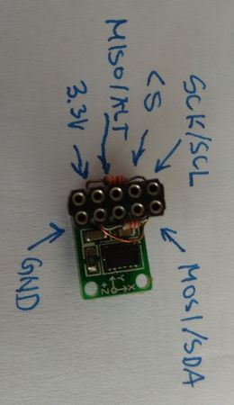

# Laboratorijska vježba 4: SPI i I2C interfejsi #

## Ciljevi i ishodi ##
Cilj vježbe je da student savlada programski interfejs za SPI i I2C serijske komunikacione interfejse u *Linux* operativnom sistemu, kao i da se upozna sa organizacijom registarske mape jednog perifernog uređaja i načinima pristupa pojedinačnim registrima u okviru ove mape.

Po završetku vježbe, student će biti sposoban da:

- podesi parametre SPI i I2C komunikacije korišćenjem odgovarajućeg programskog interfejsa u *Linux*-u,
- poveže mikrokontroler sa perifernim uređajem preko SPI i I2C interfejsa,
- omogući razmjenu podataka između mikrokontrolera i periferije.

## Priprema za vježbu ##
Očekuje se da je student upoznat (kroz prezentacije na predavanjima i konsultovanje dostupne literature) sa pravilima i parametrima SPI i I2C komunikacionih protokola, kao i sa funkcijama programskog interfejsa za SPI i I2C interfejse. Takođe, student treba da je upoznat sa osnovnim specifikacijama ADXL345 komponente.

Prije početka vježbe, student treba da ažurira stanje lokalnog repozitorijuma izvršavanjem `git pull` komande u okviru `~/ikm-labs/` direktorijuma. Ako repozitorijum nije ranije preuzet, potrebno ga je klonirati u lokalnom `home` direktorijumu korišćenjem naredbe `git clone https://github.com/knezicm/ikm-labs`. Nakon što je repozitorijum ažuriran/kloniran, potrebno je kopirati folder `lab4` sa cijelim  njegovim sadržajem u `home` direktorijum trenutnog korisnika.

## Programski interfejs za SPI (spidev API) ##
SPI kontroleru iz korisničkog domena u *Linux*-u, pristupa se preko virtuelnog fajla `/dev/spidevA.B`, gdje `A` označava broj SPI kontrolera, a `B` kanal u okviru kontrolera (jedan SPI kontroler može da ima više kanala, svaki se kontroliše zasebnim *slave select* signalom). Za konfigurisanje i razmjenu podataka, koristi se poseban programski interfejs koji se naziva *spidev API*.

Kao kod svih uređaja, pristup se omogućava otvaranjem fajla pomoću sistemskog poziva `open()`:

```
int fd;
...
fd = open("/dev/spidev0.0", O_RDWR);
if (fd < 0)
	fprintf(stderr, "Failed to open SPI device.\n");
```

Razmjenu podataka preko SPI interfejsa moguće je postići standardnim `write()` i `read()` sistemskim pozivima. Međutim, na ovaj način se postiže samo poludupleksna komunikacija. S obzirom da SPI inherentno podržava komunikaciju u punom dupleksu, ovakav pristup ima značajne nedostatke.

Prenos podataka sa punim dupleksom, kao i konfiguracija komunikacionih parametara SPI interfejsa, postiže se preko `ioctl()` sistemskog poziva kojem se prosljeđuje `struct spi_ioc_transfer` struktura koja opisuje SPI transakciju. Ova struktura ima sljedeći izgled:

```
struct spi_ioc_transfer {
	__u64	tx_buf;			// pokazivač na predajni bafer
	__u64	rx_buf;			// pokazivač na prijemni bafer
	
	__u32	len;			// broj bajtova koji se prenose
	__u32	speed_hz;		// bitska brzina u Hz
	
	__u16	delay_usecs;	// kašnjenje između transakcija (us)
	__u8	bits_per_word;	// broj bita u jednoj riječi
	__u8	cs_change;		// cs se mijenja pri između transakcija
	__u32	pad;			// padding
}
```

Funkciji `ioctl()` prosljeđuje se fajl deskriptor `fd`, komanda koja definiše parametar koji se podešava, odnosno incira razmjenu podataka i pokazivač na promjenljivu (ili niz) u kojem se nalazi dati parametar. U sljedećem segmentu koda, ilustrovan je primjer konfiguracije parametara SPI interfejsa:

```
int speed = 1000000;
int mode = 2;
int size = 8;
...
ioctl(fd, SPI_IOC_WR_MODE, &mode);			// mode (CPOL:CPHA)
ioctl(fd, SPI_IOC_WR_BITS_PER_WORD, &size);	// word size
ioctl(fd, SPI_IOC_WR_MAX_SPEED_HZ, &speed);	// max speed
```

Dodatne informacije o parametrima koji se mogu podešavati, mogu se pronaći u [spidev API](https://www.kernel.org/doc/Documentation/spi/spidev) dokumentaciji.

Kao što je već pomenuto, razmjena podataka u punom dupleksu se inicira pozivom `ioctl()` funkcije kojoj se prosljeđuje struktura `struct spi_ioc_transfer` za opis SPI transakcije:

```
struct spi_ioc_transfer spi;
unsigned char buffer = 0x55;
...
spi.tx_buf = (unsigned long)&buffer;
spi.rx_buf = (unsigned long)&buffer;
spi.len = 1;
spi.delay_usecs = 0;
spi.speed_hz = speed;
spi.bits_per_word = size;

ioctl(fd, SPI_IOC_MESSAGE(1), &spi);
```

Važno je napomenuti da makro `SPI_IOC_MESSAGE(N)` prihvata parametar `N` koji definiše koliko SPI poruka (definisanih u okviru niza struktura `struct spi_ioc_transfer`) će da se šalje u okviru date SPI transakcije. U opštem slučaju, promjenljiva `spi` može da bude definisana kao niz i da sadrži više SPI poruka.

Po završetku rada SPI uređajem, fajl je potrebno zatvoriti sistemskim pozivom `close()` kojem se prosljeđuje *file descriptor* datog fajla:

```
close(fd)
```

Da bi koristili prethodno opisane funkcije, potrebno je uključiti odgovarajuće sistemske *header* fajlove u kojima su definisani njihovi prototipi. S tim u vezi, u zaglavlju programa, treba da se nalaze sljedeće direktive:

```
#include <fcntl.h>
#include <unistd.h>
#include <sys/ioctl.h>
#include <linux/types.h>
#include <linux/spi/spidev.h>
```

## Programski interfejs za I2C (i2cdev API) ##
Korisničke aplikacije u okviru *Linux* operativnog sistema mogu da pristupe I2C uređajima preko `/dev/i2c-N` virtuelnog fajla, gdje `N` označava broj I2C kontrolera aktivnog u sistemu. Otvaranje i zatvaranje ovog fajla se, kao i u prethodnim slučajevima, realizuje pomoću `open()` i `close()` sistemskih poziva.

Razmjena podataka se može obaviti standardnim `read()`/`write()` pristupom, pri čemu se čitanje vrijednosti registra periferije tipično obavlja u dvije I2C transakcije (tj. ne koristi se kombinovani prenos sa ponovljenom start sekvencom). Kombinovana transakcija čitanja/upisa se postiže pomoću `ioctl()` funkcije kojoj se prosljeđuje `struct i2c_rdwr_ioctl_data` struktura kojima ima sljedeći izgled:

```
struct i2c_rdwr_ioctl_data {
	struct i2c_msg *msgs;	// pokazivač na niz struktura i2c_msg
	__u32 nmsgs;			// broj i2c_msg poruka
}
```

Struktura `i2c_msg` opisuje I2C poruke koje se razmjenjuju u okviru transakcije. Svaka poruka je opisana sljedećim poljima u okviru ove strukture:

```
struct i2c_msg {
	__u16 addr;		// adresa slave uređaja
	__u16 flags;	// razni flegovi koji definišu kako se odvija transakcija
	__u16 len;		// dužina poruke
	__u8 *buf;		// pokazivač na podatke u okviru poruke
}
```

Flegovi u okviru ove strukture, definišu određene parametre transakcije. Tako, na primjer, fleg `I2C_M_TEN` definiše 10-bitnu adresu *slave* uređaja, dok fleg `I2C_M_RD` definiše pristup sa čitanjem u okviru transakcije (kod transakcije sa upisom, polje `flags` treba postaviti na 0). Više informacija o ostalim dostupnim flegovima, kao i o načinu konfiguracije parametara I2C interefejsa, može se pronaći u okviru [i2cdev API](https://www.kernel.org/doc/Documentation/i2c/dev-interface) dokumentacije.

Primjer čitanja vrijednosti registra čija je adresa 0x10 periferije sa I2C adresom 0x40 sa standardnim `read()`/`write()` pristupom ima sljedeći izgled:

```
int addr = 0x40;
unsigned char reg = 0x10;
unsigned char rx_buffer[2];
unsigned char tx_buffer[2];
...
// configure slave address
ioctl(fd, I2C_SLAVE, addr)
...
tx_buffer[0] = reg;
write(fd, tx_buffer, 1);
read(fd, rx_buffer, 1);
```

Primjer čitanja vrijednosti registra čija je adresa 0x10 periferije sa I2C adresom 0x40 sa kombinovanom I2C transakcijom ima sljedeći izgled:

```
struct i2c_msg iomsgs[] = {
	[0] = {
		.addr = addr,	/* slave address */
		.flags = 0,		/* write access */
		.buf = &reg,	/* register address */
		.len = 1
	},
	[1] = {
		.addr = addr,		/* slave address */
		.flags = I2C_M_RD,	/* read access */
		.buf = rx_buffer,	/* rx buffer */
		.len = 1
	}
};

struct i2c_rdwr_ioctl_data msgset = {
	.msgs = iomsgs,
	.nmsgs = 2
};

ioctl(fd, I2C_RDWR, &msgset);
```


Konačno, da bi koristili prethodno opisane funkcije, potrebno je uključiti odgovarajuće sistemske *header* fajlove u kojima su definisani njihovi prototipi:

```
#include <fcntl.h>
#include <unistd.h>
#include <sys/ioctl.h>
#include <linux/i2c-dev.h>
#include <linux/i2c.h>
```

## Povezivanje ADXL345 modula ##
Modul sa senzorom za mjerenje ubrzanja (akelerometar) ADXL345 posjeduje dva interfejsa za komunikaciju: SPI i I2C. U oba slučaja, ADXL345 ima ulogu *slave* uređaja. I2C interfejs se omogućava ako je CS pin na visokom logičkom nivou. Za SPI, moguće je koristiti trožični i četvorožični mod. Konkretan modul koji se koristi u ovoj vježbi, koristi standardni četvorožični SPI mod.

Modul dostupan za realizaciju laboratorijske vježbe prevezan je tako da se omogući lako povezivanje sa *Raspberry Pi* platformom. Postoje dvije varijante: (1) sa eksternim *pull-up* otpornicima i (2) bez eksternih *pull-up* otpornika (slika ispod).


Iako druga varijanta modula nema eksterne *pull-up* otpornike, koji su obavezni u slučaju komunikacije preko I2C interfejsa, ovo ne predstavlja ograničenje, jer *Raspberry Pi* na I2C linijama ima *pull-up* otpornike.

Pinovi za povezivanje ADXL345 modula preko prethodno pomenutih serijskih interfejsa, prikazani su na slici ispod.



Prvo treba obratiti pažnju na pinove za napajanje modula. To su pinovi označeni sa 3.3V i GND (masa), i oni se povezuju posljednji (prvo masa pa onda napajanje).

### SPI interfejs ###
Maksimalna frekvencija serijskog takta za SPI interfejs ADXL345 senzora iznosi 5MHz. Format SPI transakcije sadrži dva ili više bajtova. Prvi bajt je uvijek komanda koja definiše adresu registra kojem se pristupa (najnižih šest bita), sedmi bit (MB) određuje da li se obavlja jednobajtni (MB=0) ili višebajtni (MB=1) prenos podataka. Konačno, najviši R/W bit definiše da li se radi o pristupu sa upisom u registar (R/W=0) ili sa čitanjem registra (R/W=1). Prenos bita treba da se obavlja prema *big-endian* konvenciji (od najvišeg prema najnižem bitu).

Nakon bajta komande, slijedi jedan ili više bajtova (u zavisnosti od toga da li je postavljen MB bit) podataka prema periferiji (ako je pristup sa upisom), odnosno prema mikrokontroleru (ako je pristup sa čitanjem).

Iz talasnih oblika specifikacije proizvođača komponente ADXL345, može se vidjeti da je za četvorožični mod potrebno koristiti sljedeće parametre SPI komunikacije: CPOL=1 i CPHA=1 (tzv. mod 3 kod *spidev API* programskog interfejsa).

Za povezivanje datog modula koriste se sljedeći pinovi:

- SCK/SCL: signal serijskog takta,
- MOSI/SDA: signal MOSI za podatke (od *master* ka *slave* uređaju),
- MISO/ALT: signal MISO za podatke (od *slave* ka *master* uređaju) i
- CS: *slave select* signal za omogućenje SPI prenosa.

Ovi pinovi se povezuju sa odgovarajućim pinovima na konektoru *Raspberry Pi* platforme sa sljedeće slike:


pri čemu u našem slučaju koristimo SPI kontroler SPI0, a periferiju povezujemo na njegov kanal 0 (SPI transakcija se aktivira signalom CE0).

Konačno, potrebno je omogućiti SPI interfejs korišćenjem alatke `raspi-config` ili editovanjem fajla `/boot/config.txt` (tako da postoji linija `dtparam=spi=on`). Ovo je neophodno samo ako SPI interfejs već nije omogućen, što je provjeriti komandom `dmesg | grep spi`.

### I2C interfejs ###
Maksimalna frekvencija serijskog takta za I2C interfejs ADXL345 senzora iznosi 400kHz. Pinovi za povezivanje modula preko I2C interfejsa su sljedeći:

- SCK/SCL: signal serijskog takta,
- MOSI/SDA: signal serijskog podatka i
- MISO/ALT: signal za selekciju adrese *slave* uređaja.

Prema specifikaciji proizvođača, povezivanjem pina za selekciju adrese uređaja (ALT) na napajanje (3.3V) postavljamo 7 -bitnu adresu *slave* uređaja na 0x1D, dok se povezivanjem ovog pina na masu adresa postavlja na 0x53.

Pinovi I2C interfejsa (SCL i SDA) treba da budu povezani sa odgovarajućim pinovima na konektoru *Raspberry Pi* platforme sa sljedeće slike:


pri čemu u našem slučaju koristimo I2C kontroler I2C1 na pinovima BCM2 i BCM3.

Konačno, potrebno je omogućiti I2C interfejs korišćenjem alatke `raspi-config` ili editovanjem fajla `/boot/config.txt` (tako da postoji linija `dtparam=i2c_arm=on`). Ovo je neophodno samo ako I2C interfejs već nije omogućen, što je provjeriti komandom `dmesg | grep i2c`.

## Zadaci za samostalnu izradu ##
**Važne napomene:** Izmjene koje je potrebno napraviti u datom izvornom kodu, označene su sa `TODO` u okviru linija sa komentarima.

### Zadatak 1: Povezivanje i pristup registrima ADXL345 senzora preko SPI interfejsa ###

U zadatku je potrebno uraditi sljedeće:

1. Dopuniti polazni izvorni kod `spi.c`, koji se nalazi u folderu `lab4-1`, tako da omogući čitanje identifikacionog broja ADXL345 senzora prilikom inicijalizacije, kao i kontinualno čitanje ubrzanja po sve tri ose. Sve pročitane informacije trebaju da se prikazuju u konzoli.

2. Povezati dati ADXL345 modul sa *Raspberry Pi* platformom.

3. Kroskompajlirati dati program i prenijeti dobijeni izvršni fajl na ciljnu platformu, a zatim pokrenuti njegovo izvršavanje.

4. Verifikovati ispravnost rada analizom podataka koji se prikazuju na konzoli. Dodatno, verifikovati ispravnost parametara SPI komunikacije posmatranjem talasnih oblika SCK i MOSI signala na osciloskopu.

### Zadatak 2: Povezivanje i pristup registrima ADXL345 senzora preko I2C interfejsa ###

U zadatku je potrebno uraditi sljedeće:

1. Dopuniti polazni izvorni kod `i2c.c`, koji se nalazi u folderu `lab4-2`, tako da omogući čitanje identifikacionog broja ADXL345 senzora prilikom inicijalizacije, kao i kontinualno čitanje ubrzanja po sve tri ose. Sve pročitane informacije trebaju da se prikazuju u konzoli.

2. Povezati dati ADXL345 modul sa *Raspberry Pi* platformom.

3. Kroskompajlirati dati program i prenijeti dobijeni izvršni fajl na ciljnu platformu, a zatim pokrenuti njegovo izvršavanje.

4. Verifikovati ispravnost rada analizom podataka koji se prikazuju na konzoli. Posmatranjem talasnih oblika I2C transakcije (signali SCL i SDA), utvrditi brzinu komunikacije i format I2C transakcije. U okviru I2C transakcije, identifikujte sve relevantne elemente: start i stop sekvence, adresu uređaja i bit koji definiše način pristupa, ACK/NACK sekvence, te podatke koji se prenose.

5. Modifikovati prethodni program tako da se pritup registrima odvija u dvije umjesto jedne kombinovane I2C transakcije. Verifikovati dobijeni rezultat pomoću osciloskopa.


