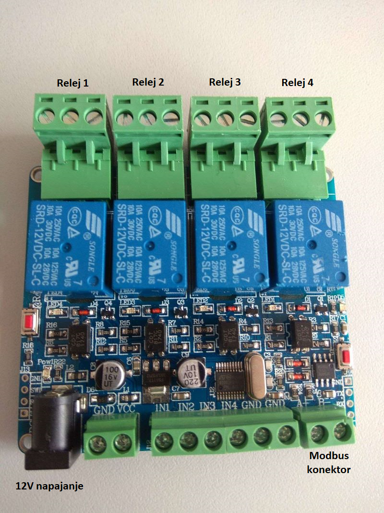

# Laboratorijska vježba 5: Modbus RTU protokol #

## Ciljevi i ishodi ##
Cilj vježbe je da se student upozna sa osnovama Modbus RTU protokola i da savlada API biblioteke *libmodbus*, koji omogućava realizaciju aplikacija za razmjenu poruka između čvorova povezanih u Modbus mrežu.

Po završetku vježbe, student će biti sposoban da:

- poveže dva Modbus čvora (*master/client* i *slave/server*),
- koristi osnovne API funkcije *libmodbus* biblioteke,
- razvije aplikaciju koja omogućava osnovnu komunikaciju sa jednim Modbus RTU čvorom,
- interpretira sadržaj Modbus RTU okvira.

## Priprema za vježbu ##
Očekuje se da je student upoznat (kroz prezentacije na predavanjima i konsultovanje dostupne literature) sa osnovnim pravilima komunikacije Modbus RTU protokola.

Prije početka vježbe, student treba da ažurira stanje lokalnog repozitorijuma izvršavanjem `git pull` komande u okviru `~/ikm-labs/` direktorijuma. Ako repozitorijum nije ranije preuzet, potrebno ga je klonirati u lokalnom `home` direktorijumu korišćenjem naredbe `git clone https://github.com/knezicm/ikm-labs`. Nakon što je repozitorijum ažuriran/kloniran, potrebno je kopirati folder `lab5` sa cijelim  njegovim sadržajem u `home` direktorijum trenutnog korisnika.

## Programski interfejs *libmodbus* biblioteke ##
Bibilioteka *libmodbus* predstavlja implementaciju različitih varijanti Modbus protokola za različite platforme u C programskom jeziku. Bibilioteka obezbjeđuje odgovarajući API, koji omogućava uspostavljanje komunikacije, podešavanje parametara, te razmjenu podataka. Iako je podržana funkcionalnost *master* i *slave* čvora, u okviru vježbe će se koristiti samo *master* (*client*) režim rada, koji omogućava prozivanje dostupnog *slave* uređaja. Više informacija o samoj biblioteci, student može pronaći na zvaničnoj web stranici [*libmodbus* biblioteke](https://libmodbus.org/).

U konkretnom slučaju, koristi se verzija *libmodbus* biblioteke prilagođena *Raspberry Pi* platformi. U vježbi je potrebno preuzeti repozitorijum biblioteke, a zatim kroskompajlirati dati izvorni kod za datu platformu.

Prvi korak je kloniranje izvornog koda biblioteke sa repozitorijuma. U tu svrhu, koristimo sljedeću komandu:

```
git clone --depth=1 https://github.com/dhruvvyas90/libmodbus
```

Prethodnu komandu treba izvršiti u okviru radnog direktorijuma laboratorijske vježbe (`lab5`).

S obzirom da biblioteka koristi programsku podršku za automatizovano kompajliranje projekta (tzv. `automake` *build system*), neophodno je provjeriti da li su na razvojnoj platformi instalirani odgovarajući softverski paketi (u konkretnom slučaju, `automake`, `autoconf` i `libtool`). To se postiže komandom `dpkg -l {packages_list}`. Instalacija pomenutih softverskih paketa, u *Ubuntu* distribuciji, obavlja se standardnom `apt-get` komandom:

```
sudo apt-get install -y automake autoconf libtool
```

Nakon što je sistem pripremljen, sljedeći korak je kroskompajliranje biblioteke. Prvo je potrebno napraviti folder (npr. folder `usr` u radnom direktorijumu laboratorijske vježbe) u kojem će se nalaziti prekompajliranja (binarna) verzija biblioteke sa kojom će se kasnije dinamički linkovati izvršni fajl aplikacije.

```
mkdir usr
```

Nakon toga, prelazimo u folder u kojem se nalazi repozitorijum *libmodbus* biblioteke i pokrećemo niz komandi za konfiguraciju *build* sistema i kompajliranje projekta.

```
cd libmodbus
./autogen.sh
./configure ac_cv_func_malloc_0_nonnull=yes --prefix=/path/to/usr --host=arm-linux-gnueabihf
make
make install
```

Važno je napomenuti da opcija `--prefix` definiše lokaciju na koju će se instalirati binarna verzija biblioteke komandom `make install` (u konkretnom slučaju `/path/to/usr` treba zamijeniti apsolutnom putanjom prethodno kreiranog `usr` foldera), dok  opcijom `--host` definišemo arhitekturu za koju se biblioteka kompajlira (u našem slučaju, to je ARM arhitektura).

Kao rezultat, u okviru `usr` foldera dobijamo binarnu verziju biblioteke, kao i *header* fajlove neophodne za kroskompajliranje aplikacije koja poziva API funkcije *libmodbus* biblioteke. Studentu se preporučuje da izdvoji određeno vrijeme tokom vježbe i upozna se sa strukturom `usr` foldera i identifikuje lokacije dinamičke biblioteke i pomenutih *header* fajlovam jer su ove informacije esencijalne za ispravno kroskompajliranje aplikacije.

Nakon što je biblioteka kroskompajlirana, može se pristupiti realizaciji aplikacije koja omogućava komunikaciju sa Modbus RTU *slave* čvorom. Sama biblioteka budi opširan skup funkcija. Najznačajnije funkcije su pobrojane u tabeli ispod. Prototip svake funkcije, kao i dodatne informacije sa konkretnim primjerima, mogu se pronaći na datim linkovima.

|Funkcija|Opis|
|--------|----|
|[`modbus_new_rtu()`](https://libmodbus.org/docs/v3.0.6/modbus_new_rtu.html)|Kreira novi *libmodbus* kontekst za RTU tip protokola|
|[`modbus_free()`](https://libmodbus.org/docs/v3.0.6/modbus_free.html)|Oslobađa resurse *libmodbus* konteksta|
|[`modbus_set_debug()`](https://libmodbus.org/docs/v3.0.6/modbus_set_debug.html)|Uključuje/isključuje mod za debagovanje|
|[`modbus_set_slave()`](https://libmodbus.org/docs/v3.0.6/modbus_set_slave.html)|Postavlja identifikator *slave* uređaja u *libmodbus* kontekstu|
|[`modbus_connect()`](https://libmodbus.org/docs/v3.0.6/modbus_connect.html)|Uspostavlja Modbus vezu|
|[`modbus_close()`](https://libmodbus.org/docs/v3.0.6/modbus_close.html)|Raskida Modbus vezu|
|[`modbus_read_bits()`](https://libmodbus.org/docs/v3.0.6/modbus_read_bits.html)|Čita stanje više izlaznih bita (FC=0x01)|
|[`modbus_read_input_bits()`](https://libmodbus.org/docs/v3.0.6/modbus_read_input_bits.html)|Čita stanje više ulaznih bita (FC=0x02)|
|[`modbus_read_registers()`](https://libmodbus.org/docs/v3.0.6/modbus_read_registers.html)|Čita stanje više izlaznih registara (FC=0x03)|
|[`modbus_read_input_registers()`](https://libmodbus.org/docs/v3.0.6/modbus_read_input_registers.html)|Čita stanje više ulaznih registara (FC=0x04)|
|[`modbus_write_bit()`](https://libmodbus.org/docs/v3.0.6/modbus_write_bit.html)|Definiše stanje izlaznog bita (FC=0x05)|
|[`modbus_write_register()`](https://libmodbus.org/docs/v3.0.6/modbus_write_register.html)|Upisuje vrijednost u izlazni registar (FC=0x06)|
|[`modbus_write_bits()`](https://libmodbus.org/docs/v3.0.6/modbus_write_bits.html)|Definiše stanje više izlaznih bita (FC=0x0F)|
|[`modbus_write_registers()`](https://libmodbus.org/docs/v3.0.6/modbus_write_registers.html)|Upisuje vrijednosti u više izlaznih registara (FC=0x10)|
|[`modbus_write_and_read_registers()`](https://libmodbus.org/docs/v3.0.6/modbus_write_and_read_registers.html)|Upisuje vrijednosti u više izlaznih registara, a zatim čita stanje više izlaznih registara (FC=0x17)|

Osnovna aplikacija sadrži sljedeće elemente. Prvo je potrebno deklarisati pokazivač na specifičnu Modbus strukturu pod nazivom *Modbus kontekst* (`modbus_t *ctx`), koja definiše parametre Modbus protokola. Nakon toga, pozivom funkcije `modbus_new_rtu()` kontekst Modbus protokola se inicijalizuje odgovarajućim parametrima.

```
modbus_t *ctx;
...
ctx = modbus_new_rtu("/dev/ttyAMA0", 19200, 'N', 8, 1);

if (ctx == NULL) {
	fprintf(stderr, "Unable to create the libmodbus context!\n");
	return -1;
}
```

Nakon što je kreiran kontekst Modbus protokola, korišćenjem `modbus_set_slave()` funkcije, postavljamo adresu *slave* uređaja sa kojim želimo da razmjenjujemo poruke.

Opciono, možemo omogućiti prikazivanje *debug* informacija (funkcija `modbus_set_debug()`), što je korisno prilikom razvoja Modbus aplikacija.

Konačno, nakon povezivanja na Modbus mrežu (funkcija `modbus_connect()`), mogu se razmjenjivati poruke sa definisanim uređajem korišćenjem datih funkcija. Po završetku, potrebno je raskinuti vezu i osloboditi resurse.

```
if (modbus_connect(ctx) == -1) {
	fprintf(stderr, "Connection failed.\n");
	modbus_free(ctx);
	return -1;
}
// Do some communication over Modbus
...
// Closing the connection
modbus_close(ctx);
modbus_free(ctx);
```

S obzirom da je data biblioteka prilagođena za izvršavanje na *Raspberry Pi* platformi, pri čemu je obezbjeđena kontrola smjera prenosa RS-485 transivera pomoću proizvoljno odabranog GPIO pina, potrebno je prije uspostavljanja i nakon raskidanja veze sa Modbus mrežom, pozvati odgovarajuće funkcije kojima se definiše koji GPIO pin je zadužen za kontrolu smjera RS-485 transivera.

```
modbus_enable_rpi(ctx, TRUE);
modbus_configure_rpi_bcm_pin(ctx, BCM_PIN_DE);
modbus_rpi_pin_export_direction(ctx);
// Do some communication over Modbus
...
// On closing the connection
modbus_rpi_pin_unexport_direction(ctx);
```

Da bi koristili prethodno opisane funkcije, potrebno je uključiti odgovarajuće sistemske *header* fajlove u kojima su definisani njihovi prototipi. S tim u vezi, na početku programa, treba da se nalaze sljedeće direktive:

```
#include <stdio.h>
#include <unistd.h>
#include <modbus.h>
```

## Modbus *slave* sa 4-kanalnim relejnim izlazom ##
Modbus RTU uređaj, koji se koristi u okviru vježbe, je 4-kanalni relejni izlaz prikazan na sljedećoj slici.



Na slici su posebno istaknuta četiri relejna izlaza, konektor za priključivanje na Modbus mrežu (priključci A i B), kao i konektor za napajanje (12V jednosmjernog napona). Povezivanje se ostvaruje tako što se priključci RS-485 transivera, koji je povezan sa *Raspberry Pi* platformom, povezuju upredenom paricom sa Modbus konektorom uređaja (A priključak transivera na A priključak uređaja, B priključak transivera na B priključak uređaja). Kada se koriste upredene parice veće dužine, neophodno je obezbijediti terminaciju magistrale na oba kraja kako bi se eleminisala pojava refleksija. Važno je napomenuti da se napajanje Modbus uređaja i *Raspberry Pi* platforme priključuje posljednje.

Dati Modbus uređaj koristi Modbus RTU protokol, čiji su parametri serijske komunikacije: 9600 bps, 8 bita podataka, bez parnosti, jedan stop bit. Adresa Modbus *slave* uređaja je 1.

Iako uređaj podržava neke dodatne opcije, u vježbi će se manipulisati samo relejnim izlazima. Oni su modelovani kao digitalni izlazi (*coils* u Modbus terminologiji). Da bi uključili/isključili odgovarajući relejni izlaz, potrebno je definisati njegovu adresu i željeno stanje (uključeno ili isključeno). Adrese datih relejnih izlaza datog uređaja, prikazane su u tabeli ispod.

|Modbus adresa|Adresa u okviru|Procesna varijabla|
|-------------|---------------|------------------|
|#000001|0x0000|Relejni izlaz #1|
|#000002|0x0001|Relejni izlaz #2|
|#000003|0x0002|Relejni izlaz #3|
|#000004|0x0003|Relejni izlaz #4|

Ovdje je potrebno napomenuti da izvorna Modbus specifikacija definiše *Modbus adrese* kao 5-cifrene decimalne brojeve, čija cifra najveće težine definiše tip promjenljive (0 - *coils*, 1 - *discrete inputs*, 3 - input registers, 4 - *holding registers*). Na taj način se može definisati maksimalno 9999 adresa za svaki tip promjenljive. Kasnije je ovaj opseg, iz praktičnih razloga, proširen na 6 cifara, kako bi se omogućilo puno 16-bitno adresiranje.

Modbus adrese se transliraju u adrese u opsegu od 0 do 9998 (od 0x0000 do 0x270E), odnosno od 0 do 65535 (od 0x0000 do 0xFFFF) za prošireni opseg. Translirane adrese se prenose u okvirima sa podacima, a tip adresirane promjenljive se definiše funkcijskim kodom (npr. 0x05 označava funkcijski kod za definisanje stanja digitalnog izlaza, vidjeti funkciju `modbus_write_bit()`).

Više informacija o Modbus protokolu, može se pronaći u specifikaciju aplikacionog sloja, odnosno na [*Wikipedia* stranici](https://en.wikipedia.org/wiki/Modbus) posvećenoj ovom protokolu.

## Zadaci za samostalnu izradu ##
**Važne napomene:** Izmjene koje je potrebno napraviti u datom izvornom kodu, označene su sa `TODO` u okviru linija sa komentarima.

### Zadatak 1: Manipulacija relejnim izlazima 4-kanalnog Modbus uređaja ###

U zadatku je potrebno uraditi sljedeće:

1. Dopuniti polazni izvorni kod `modbus-master.c`, koji se nalazi u radnom folderu vježbe. Potrebno je podesiti parametre komunikacije i omogućiti povezivanje na Modbus mrežu. Dodatno, korišćenjem odgovarajućih funkcija specifičnih za *Raspberry Pi* platformu, obezbijediti kontrolu smjera datog RS-485 transivera.

2. U okviru programa, obezbijediti sljedeću funkcionalnost: Poslati Modbus okvir kojim se uključuje odgovarajući kanal relejnog izlaza (po sopstvenom izboru), zadržati uključeno stanje pet sekundi (koristiti funkciju [`sleep()`](http://man7.org/linux/man-pages/man3/sleep.3.html)), a zatim poslati Modbus okvir kojim se isključuje dati relejni izlaz.

3. Kroskompajlirati dati program i prenijeti dobijeni izvršni fajl (uključujući sve biblioteke neophodne za njegovo izvršavanje) na ciljnu platformu, a zatim pokrenuti njegovo izvršavanje. Korišćenjem osciloskopa, verifikovati ispravnost Modbus okvira koji se šalje na TX liniji *Raspberry Pi* platforme (potvrditi da je okvir koji se šalje u skladu sa Modbus specifikacijom).

4. Verifikovati funkcionalnost napisanog programa na platformi koja je povezana sa stvarnim 4-kanalnim relejnim modulom.
