# Laboratorijska vježba 9: Real-Time Ethernet (RTE) protokoli #

## *EtherCAT* protokol ##

U ovoj vježbi ćemo koristiti *open-source* implementaciju *EtherCAT master* uređaja pod nazivom *Simple Open EtherCAT Master* (SOEM). U tom smislu, prvo je potrebno da kloniramo SOEM repozitorijum i da se prebacimo na posljednju stabilnu verziju (v1.4.0).

```sh
$ git clone https://github.com/OpenEtherCATsociety/SOEM.git
$ cd SOEM/
$ git checkout v1.4.0
```

Nakon što smo klonirali repozitorijum, pokrenućemo proces kompajliranja softvera za x86 platformu.

```sh
$ mkdir build
$ cd build
$ cmake ..
$ make
```

Svi artifakti koji se generišu prilikom procesa kompajliranja smještaju se u prethodno kreirani `build` folder. Podrazumijevano, dobijamo nekoliko programa koji nam omogućavaju konfiguraciju i testiranje *EtherCAT* mreže. Prva alatka koju ćemo koristiti je `slaveinfo` (nalazi se u folderu `build/test/linux/slaveinfo`) alatka koja skenira mrežu i prikazuje osnovne informacije o uređajima.

Ukoliko pokrenemo ovu alatku bez ikakvih argumenata, dobijamo sljedeći ispis.

```sh
$ cd test/linux/slaveinfo/
$ ./slaveinfo
SOEM (Simple Open EtherCAT Master)
Slaveinfo
Usage: slaveinfo ifname [options]
ifname = eth0 for example
Options :
 -sdo : print SDO info
 -map : print mapping
Available adapters
Description : lo, Device to use for wpcap: lo
Description : enp0s3, Device to use for wpcap: enp0s3
Description : enp0s8, Device to use for wpcap: enp0s8
End program
```

Jasno je da alatka očekuje da se proslijede neke informacije kroz argumente komandne linije (kao što je naziv mrežnog interfejsa na koji su priključeni *EtherCAT* uređaji, kao i neke dodatne opcije). Ovdje napominjemo da je takođe neophodno da pokrenemo alatku sa višim nivoom privilegija (`sudo`) kako bi program mogao da koristi resurse mrežnog interfejsa.

Ukoliko nemamo priključenih *EtherCAT* uređaja, dobijamo sljedeći ispis.

```sh
$ sudo ./slaveinfo enp0s8
SOEM (Simple Open EtherCAT Master)
Slaveinfo
Starting slaveinfo
ec_init on enp0s8 succeeded.
No slaves found!
End slaveinfo, close socket
End program
```

Ukoliko su priključeni *EtherCAT slave* uređaji, dobijamo informacije o svakom detektovanom uređaju, kao što je prikazano ispod.

```sh
$ sudo ./slaveinfo enp0s8
SOEM (Simple Open EtherCAT Master)
Slaveinfo
Starting slaveinfo
ec_init on enp0s8 succeeded.
3 slaves found and configured.
Calculated workcounter 3

Slave:1
 Name:EK1100
 Output size: 0bits
 Input size: 0bits
 State: 4
 Delay: 0[ns]
 Has DC: 1
 DCParentport:0
 Activeports:1.1.0.0
 Configured address: 1001
 Man: 00000002 ID: 044c2c52 Rev: 00110000
 FMMUfunc 0:0 1:0 2:0 3:0
 MBX length wr: 0 rd: 0 MBX protocols : 00
 CoE details: 00 FoE details: 00 EoE details: 00 SoE details: 00
 Ebus current: -2000[mA]
 only LRD/LWR:0

Slave:2
 Name:EL2002
 Output size: 2bits
 Input size: 0bits
 State: 4
 Delay: 140[ns]
 Has DC: 1
 DCParentport:1
 Activeports:1.1.0.0
 Configured address: 1002
 Man: 00000002 ID: 07d23052 Rev: 00100000
 SM0 A:0f00 L:   1 F:00090044 Type:3
 FMMU0 Ls:00000000 Ll:   1 Lsb:0 Leb:1 Ps:0f00 Psb:0 Ty:02 Act:01
 FMMUfunc 0:1 1:0 2:0 3:0
 MBX length wr: 0 rd: 0 MBX protocols : 00
 CoE details: 00 FoE details: 00 EoE details: 00 SoE details: 00
 Ebus current: 100[mA]
 only LRD/LWR:0

Slave:3
 Name:EL1012
 Output size: 0bits
 Input size: 2bits
 State: 4
 Delay: 295[ns]
 Has DC: 1
 DCParentport:1
 Activeports:1.0.0.0
 Configured address: 1003
 Man: 00000002 ID: 03f43052 Rev: 00100000
 SM0 A:1000 L:   1 F:00010000 Type:4
 FMMU0 Ls:00000001 Ll:   1 Lsb:0 Leb:1 Ps:1000 Psb:0 Ty:01 Act:01
 FMMUfunc 0:2 1:0 2:0 3:0
 MBX length wr: 0 rd: 0 MBX protocols : 00
 CoE details: 00 FoE details: 00 EoE details: 00 SoE details: 00
 Ebus current: 90[mA]
 only LRD/LWR:0
End slaveinfo, close socket
End program
```

Kao što možemo da vidimo iz prethodnog ispisa, u mreži su detektovana tri uređaja: (1) *EtherCAT bus coupler* [EK1100](https://www.beckhoff.com/en-en/products/i-o/ethercat-terminals/ek1xxx-bk1xx0-ethercat-coupler/ek1100.html) koji omogućava povezivanje modularnih *slave* uređaja sa *Ethernet* infrastrukturom, (2) modularni 2-kanalni digitalni izlaz [EL2002](https://www.beckhoff.com/en-en/products/i-o/ethercat-terminals/el2xxx-digital-output/el2002.html) i (3) modularni 2-kanalni digitalni ulaz [EL1012](https://www.beckhoff.com/en-en/products/i-o/ethercat-terminals/el1xxx-digital-input/el1012.html).

> [!NOTE]  
> U primjerima datim iznad, *EtherCAT slave* uređaji su priključeni na mrežni interfejs računara čije je ime `enp0s8`. Obratite pažnju da odaberete ispravan mrežni interfejs (jer obično postoji više različitih mrežnih interfejsa, npr. *WiFi* mrežna kartica).

Ukoliko proslijedimo opciju `-map` dobijamo dodatne informacije o načinu na koji se mapiraju procesni podaci u svakom uređaju (koji razmjenjuje procesne podatke).

```sh
$ sudo ./slaveinfo enp0s8 -map
SOEM (Simple Open EtherCAT Master)
Slaveinfo
Starting slaveinfo
ec_init on enp0s8 succeeded.
3 slaves found and configured.
Calculated workcounter 3

Slave:1
 Name:EK1100
 Output size: 0bits
 Input size: 0bits
 State: 4
 Delay: 0[ns]
 Has DC: 1
 DCParentport:0
 Activeports:1.1.0.0
 Configured address: 1001
 Man: 00000002 ID: 044c2c52 Rev: 00110000
 FMMUfunc 0:0 1:0 2:0 3:0
 MBX length wr: 0 rd: 0 MBX protocols : 00
 CoE details: 00 FoE details: 00 EoE details: 00 SoE details: 00
 Ebus current: -2000[mA]
 only LRD/LWR:0
PDO mapping according to SII :

Slave:2
 Name:EL2002
 Output size: 2bits
 Input size: 0bits
 State: 4
 Delay: 145[ns]
 Has DC: 1
 DCParentport:1
 Activeports:1.1.0.0
 Configured address: 1002
 Man: 00000002 ID: 07d23052 Rev: 00100000
 SM0 A:0f00 L:   1 F:00090044 Type:3
 FMMU0 Ls:00000000 Ll:   1 Lsb:0 Leb:1 Ps:0f00 Psb:0 Ty:02 Act:01
 FMMUfunc 0:1 1:0 2:0 3:0
 MBX length wr: 0 rd: 0 MBX protocols : 00
 CoE details: 00 FoE details: 00 EoE details: 00 SoE details: 00
 Ebus current: 100[mA]
 only LRD/LWR:0
PDO mapping according to SII :
  SM0 RXPDO 0x1600 Channel 1
     addr b   index: sub bitl data_type    name
  [0x0000.0] 0x7000:0x01 0x01 BOOLEAN      Output
  SM0 RXPDO 0x1601 Channel 2
     addr b   index: sub bitl data_type    name
  [0x0000.1] 0x7010:0x01 0x01 BOOLEAN      Output

Slave:3
 Name:EL1012
 Output size: 0bits
 Input size: 2bits
 State: 4
 Delay: 300[ns]
 Has DC: 1
 DCParentport:1
 Activeports:1.0.0.0
 Configured address: 1003
 Man: 00000002 ID: 03f43052 Rev: 00100000
 SM0 A:1000 L:   1 F:00010000 Type:4
 FMMU0 Ls:00000001 Ll:   1 Lsb:0 Leb:1 Ps:1000 Psb:0 Ty:01 Act:01
 FMMUfunc 0:2 1:0 2:0 3:0
 MBX length wr: 0 rd: 0 MBX protocols : 00
 CoE details: 00 FoE details: 00 EoE details: 00 SoE details: 00
 Ebus current: 90[mA]
 only LRD/LWR:0
PDO mapping according to SII :
  SM0 TXPDO 0x1A00 Channel 1
     addr b   index: sub bitl data_type    name
  [0x0001.0] 0x6000:0x01 0x01 BOOLEAN      Input
  SM0 TXPDO 0x1A01 Channel 2
     addr b   index: sub bitl data_type    name
  [0x0001.1] 0x6010:0x01 0x01 BOOLEAN      Input
End slaveinfo, close socket
End program
```

> [!NOTE]  
> *EtherCAT bus coupler* EK1100 ne razmjenjuje procesne podatke, što je razlog zašto nemamo nikakve informacije o mapiranju procesnih podataka za ovaj uređaj.

Sada ćemo pokrenuti testnu aplikaciju (koja se nalazi u folderu `build/test/linux/simple_test`) koja konfiguriše mrežu i postavlja uređaje u operaciono stanja, nakon čega se razmjenjuju procesni podaci.

```sh
$ cd test/linux/simple_test/
$ sudo ./simple_test enp0s8
SOEM (Simple Open EtherCAT Master)
Simple test
Starting simple test
ec_init on enp0s8 succeeded.
3 slaves found and configured.
Slaves mapped, state to SAFE_OP.
segments : 1 : 2 0 0 0
Request operational state for all slaves
Calculated workcounter 3
Operational state reached for all slaves.
Processdata cycle  416, WKC 3 , O: 00 I: 00 T:3348283526082752880
OK : all slaves resumed OPERATIONAL.
Processdata cycle  420, WKC 3 , O: 00 I: 00 T:3348283526130705720
OK : all slaves resumed OPERATIONAL.
Processdata cycle  448, WKC 3 , O: 00 I: 00 T:3348283526490960560
OK : all slaves resumed OPERATIONAL.
Processdata cycle  537, WKC 3 , O: 00 I: 00 T:3348283527915067120
OK : all slaves resumed OPERATIONAL.0 I: 00 T:3348283527940158760
Processdata cycle  545, WKC 3 , O: 00 I: 00 T:3348283527993216200
OK : all slaves resumed OPERATIONAL.0 I: 00 T:3348283528014884920
Processdata cycle  553, WKC 3 , O: 00 I: 00 T:3348283528069294520
OK : all slaves resumed OPERATIONAL.0 I: 00 T:3348283528093096440
```

U datom primjeru, mreža sadrži tri *slave* uređaja, od kojih dva razmjenjuju procesne podatke (digitalne ulaze i izlaze). Trenutne vrijednosti procesnih podataka se ispisuju u formatu `O: 00` za izlazne, odnosno `I: 00` za ulazne procesne podatke. Takođe, prikazuje se informacija o trenutnom stanju *slave* uređaja, broj komunikacionog ciklusa, vrijednost radnog brojača (`WKC`), te sistemsko vrijeme (`T:`).

Procesna slika u testnoj aplikaciji mapirana je na globalnu promjenljivu pod nazivom `IOmap`. Izmjenom procesnih podataka u ovoj promjenljivoj na odgovarajućoj lokaciji možemo da promijenimo stanje digitalnih izlaza EL2002 uređaja.

Više informacija o načinu na koji može da se se manipuliše procesnim podacima u okviru SOEM implementacije, može se pronaći u [zvaničnoj dokumentaciji](https://openethercatsociety.github.io/doc/soem/).

## *Ethernet Powerlink* protokol ##

Za *Ethernet Powerlink* protokol dostupno je *open-source* rješenje pod nazivom *openPOWERLINK*, u okviru kojeg su date implementacije MN i CN čvora za različite vrste platformi. U ovoj vježbi ćemo demonstrirati realizaciju MN čvora na *Windows* platformi (u vidu prekompajliranje demo aplikacije koja je bazirana na QT okruženju), dok ćemo kao CN čvor koristiti *Raspberry Pi* platformu.

S obzirom da se demo aplikacija na *Windows* platformi instalira na standardan način, ovdje ćemo ilustrovati postupak kroskompajliranja *openPOWERLINK* implamantacije CN čvora za *Raspberry Pi* platformu. Ova implementacija zavisi od *libpcap* biblioteke koja omogućava pristup mrežnom interfejsu u *Linux* okruženju. Prema tome, prvi korak je da preuzmemo ovu biblioteku i kroskompajliramo je za *Raspberry Pi* platformu. Da bi to postigli, potrebno je da pratimo sljedeće korake:

```sh
$ wget http://www.tcpdump.org/release/libpcap-1.10.4.tar.gz
$ tar -xzf libpcap-1.10.4.tar.gz
$ cd libpcap-1.10.4/
$ ./configure --host=arm-linux-gnueabihf --prefix=$(arm-linux-gnueabihf-gcc --print-sysroot)/usr/
$ make
$ make install
```

Ukoliko su prethodni koraci uspješno završeni, kao rezultat ćemo dobiti kroskompajliranu *libpcap* biblioteku instaliranu na `sysroot` lokaciji *toolchain*-a koji koristimo za *Raspberry Pi* platformu. Da li je instalacija bila uspješna, možete potvrditi sljedećom komandom:

```sh
$ ls $(arm-linux-gnueabihf-gcc --print-sysroot)/usr/lib | grep libpcap
```

Ukoliko je sve kako treba, dobićete sljedeći ispis:

```sh
libpcap.a
libpcap.so
libpcap.so.1
libpcap.so.1.10.4
```

To nam potvrđuje da je biblioteka instalirana na ispravnu lokaciju.

> [!NOTE]  
> Preporučuje se da provjerite da li je biblioteka ispravno kroskompajlirana tako što ćete da pokrenete komandu `file libpcap.so.1.10.4` i potvrdite da format fajla odgovara očekivanom (ELF format za 32-bitnu ARM arhitekturu).

Prije kroskompajliranja *openPOWERLINK* implementacije CN čvora za *Raspberry Pi* platformu, prvo trebamo klonirati repozitorijumi prebaciti se na posljednju stabilnu verziju softvera.

```sh
$ git clone https://github.com/OpenAutomationTechnologies/openPOWERLINK_V2.git
$ cd openPOWERLINK_V2/
$ git checkout V2.7.2
```

Sada možemo pistupiti postupku kroskompajliranja *openPOWERLINK* demo aplikacije za CN uređaj. Ovaj projekat koristi *CMake* infrastrukturu za generisanje fajlova neophodnih za kompajliranje projekta. Prije svega, potvrdite da imate instaliran *CMake* alat na računaru (ukoliko to nije slučaj, možete ga lako instalirati komande `sudo apt install cmake` u okviru *Ubuntu* okruženja). Sljedeći korak je da kopirate priloženi *CMake toolchain* fajl (`toolchain-rpi.cmake`) u folder `<OPLK_INSTALL_DIR>/cmake`, gdje `<OPLK_INSTALL_DIR>` lokacja direktorijuma u kojem je kloniran *openPOWERLINK* projekat.

Prije kroskompajliranja demo aplikacije, potrebno je da kroskompajliramo i instaliramo mrežni stek *Ethernet Powerlink* protokola.

```sh
$ cd <OPLK_INSTALL_DIR>/stack/build/linux/
$ cmake ../.. -DCMAKE_TOOLCHAIN_FILE=../../../cmake/toolchain-rpi.cmake -DCMAKE_BUILD_TYPE=Release
$ make
$ make install
```

> [!NOTE]  
> Opcijom `CMAKE_TOOLCHAIN_FILE` specificiramo lokaciju prethodno kopiranog *CMake toolchain* fajla, dok opcijom `CMAKE_BUILD_TYPE` specificiramo konfiguraciju softvera koji kroskompajliramo (*Release* ili *Debug*). U našem slučaju biramo *Release* konfiguraciju kojom se generišu fajlovi manje veličine. *Debug* konfiguracija nam nije neophodna, jer nećemo debagovati softver.

Komandom `make install` generisane biblioteke se instaliraju na podrazumijevanu lokaciju (direktorijum `<OPLK_INSTALL_DIR>/stack/lib/linux/arm/`).

Sada možemo da kroskompajliramo i demo aplikaciju.

```sh
$ cd <OPLK_INSTALL_DIR>/apps/demo_cn_console/build/linux/
$ cmake ../.. -DCMAKE_TOOLCHAIN_FILE=../../../../cmake/toolchain-rpi.cmake
$ make
$ make install
```

Kao i u slučaju biblioteke sa mrežnim stekom, `make install` komandom instaliramo izvršni fajl demo aplikacije u podrazumijevani folder (`<OPLK_INSTALL_DIR>/bin/linux/arm/demo_cn_console`).

Ovako dobijeni fajlovi se moraju kopirati na ciljnu platformu (*Raspberry Pi*). Ovdje napominjemo da je, uz izvršni fajl demo aplikacije, potrebno kopirati i prethodno kroskompajliranu *libpcap* biblioteku (potrebno je kompajlirati sve fajlove iz `lib` foldera čiji naziv počinje sa `libpcap*`).

> [!IMPORTANT]  
> Fajlove dinamičke *libpcap* biblioteke je potrebno da kopirate u sistemski folder `/usr/lib/` na *Raspberry Pi* platformi.

Prije pokretanja demo aplikacije CN čvora na *Raspberry Pi* platformi, preuzmite QT demo aplikaciju MN čvor (sa linka https://sourceforge.net/projects/qtapp.openpowerlink.p/) i instalirajte je u *Windows* okruženju. Povežite CN čvor (*Raspberry Pi*) sa MN čvorom (PC) i pokrenite demo aplikacije na obje platforme.

> [!NOTE]  
> Izvršavanje demo aplikacije CN čvora pokrećete komandom `sudo ./demo_cn_console -n 1 -d eth0`, gdje opcijom `-n` specificiramo adresu čvora, a opcijom `-d` naziv mrežnog interfejsa na koji će aplikacija da se poveže.

Kada pokrenete demo aplikaciju na *Raspberry Pi* platformi, trebalo bi da dobijete sljedeći ispis.

```sh
----------------------------------------------------
openPOWERLINK console CN DEMO application
Using openPOWERLINK stack: V2.7.2
----------------------------------------------------
2025/05/06-11:55:57 INFO     GENERIC        demo_cn_console: Stack version:V2.7.2 Stack configuration:0x00000042
Initializing openPOWERLINK stack...
2025/05/06-11:55:57 INFO     CONTROL        Initializing openPOWERLINK stack
2025/05/06-11:55:57 INFO     GENERIC        Select the network interface
Initializing process image...
Size of process image: Input = 1 Output = 1 
2025/05/06-11:55:57 INFO     GENERIC        Allocating process image: Input:1 Output:1
Linking process image vars:
Linking process vars... ok

2025/05/06-11:55:57 EVENT    STATE_CHANGE   NmtGsOff->NmtGsInitializing Originating event:NmtEventSwReset
Stack entered state: NmtGsInitializing
2025/05/06-11:55:57 EVENT    STATE_CHANGE   NmtGsInitializing->NmtGsResetApplication Originating event:NmtEventEnterResetApp
Stack entered state: NmtGsResetApplication
2025/05/06-11:55:57 EVENT    STATE_CHANGE   NmtGsResetApplication->NmtGsResetCommunication Originating event:NmtEventEnterResetCom
Stack entered state: NmtGsResetCommunication
Start POWERLINK stack... ok
Digital I/O interface with openPOWERLINK is ready!

-------------------------------
Press Esc to leave the program
Press r to reset the node
Press i to increase the digital input
Press d to decrease the digital input
Press p to print the digital outputs
-------------------------------

2025/05/06-11:55:57 EVENT    STATE_CHANGE   NmtGsResetCommunication->NmtGsResetConfiguration Originating event:NmtEventEnterResetConfig
Stack entered state: NmtGsResetConfiguration
2025/05/06-11:55:57 EVENT    STATE_CHANGE   NmtGsResetConfiguration->NmtCsNotActive Originating event:NmtEventEnterCsNotActive
Stack entered state: NmtCsNotActive
2025/05/06-11:56:02 EVENT    STATE_CHANGE   NmtCsNotActive->NmtCsBasicEthernet Originating event:NmtEventTimerBasicEthernet
Stack entered state: NmtCsBasicEthernet
```

Vidimo da je mrežni stek inicijalizovan i da se čvor nalazi u `NmtCsBasicEthernet` stanju koje omogućava osnovne mrežne servise, dok *Ethernet Powerlink* komunikacija još uvijek nije uspostavljena. Da bi ostvarili *Ethernet Poweerlink* komunikaciju, potrebno je da pokrenete i demo aplikaciju na MN čvoru. Pokretanjem ove aplikacije, dobijate prozor sa raznim opcijama. U gornjem lijevom uglu prozora se nalaze tri dugmeta prikazana na slici ispod.

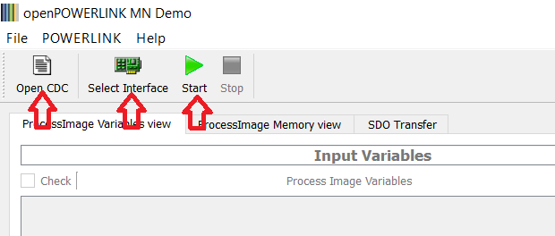

Prvo ćemo odabrati konfiguracioni fajl koji opisuje mrežu (dugme *Open CDC*). Klikom na dugme se otvara novi prozor kao na sljedećoj slici:

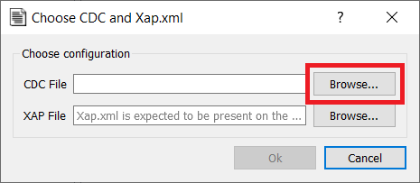

Klikom na dugme *Browse...* dobijamo mogućnost da odaberemo konfiguracioni CDC fajl. Uz aplikaciju dolazi i demo fajl, koji je dovoljan za demonstraciju rada ove jednostavne mreže, pa ćemo odabrati ovaj fajl (nalazi se u folderu `<QTDemoAppInstalDir>\output\mnobd.cdc`, gdje je `<QTDemoAppInstalDir>` putanja do foldera u kojem smo instalirali QT demo aplikaciju). Kada izaberemo ovaj fajl, trebalo bi da dobijemo izgled prozora kao na slici ispod, u okviru kojeg potvrđujemo izbor klikom na dugme *OK*.

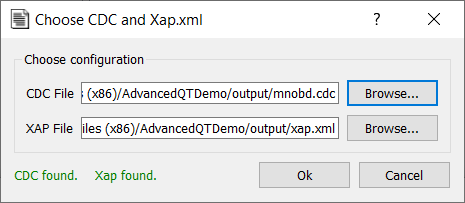

Nakon što smo definisali konfiguracioni fajl mreže, potrebno je da odaberemo mrežni interfejs (dugme *Select Interface* iz glavnog menija) na koji smo prethodno povezali CN čvor. Na sljedećoj slici je ilustrovan primjer ovog prozora sa izborom odgovarajućeg mrežnog interfejsa.

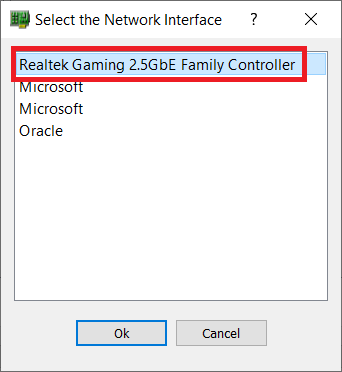

Klikom na dugme *OK* potvrđujemo izbor mrežnog interfejsa, nakon čega možemo da pokrenemo demo aplikaciju (dugme *Start* u glavnom meniju). Nakon toga, započinje proces konfiguracije *Ethernet Powerlink* mreže, što se manifestuje sljedećim ispisima u okviru demo CN aplikacije na *Raspberry Pi* platformi.

```sh
2025/05/06-11:59:41 EVENT    STATE_CHANGE   NmtCsBasicEthernet->NmtCsPreOperational1 Originating event:NmtEventDllCeSoa
Stack entered state: NmtCsPreOperational1
2025/05/06-11:59:41 EVENT    STATE_CHANGE   NmtCsPreOperational1->NmtGsResetApplication Originating event:NmtEventResetNode
Stack entered state: NmtGsResetApplication
2025/05/06-11:59:41 EVENT    STATE_CHANGE   NmtGsResetApplication->NmtGsResetCommunication Originating event:NmtEventEnterResetCom
Stack entered state: NmtGsResetCommunication
2025/05/06-11:59:42 EVENT    STATE_CHANGE   NmtGsResetCommunication->NmtGsResetConfiguration Originating event:NmtEventEnterResetConfig
Stack entered state: NmtGsResetConfiguration
2025/05/06-11:59:42 EVENT    STATE_CHANGE   NmtGsResetConfiguration->NmtCsNotActive Originating event:NmtEventEnterCsNotActive
Stack entered state: NmtCsNotActive
2025/05/06-11:59:42 EVENT    STATE_CHANGE   NmtCsNotActive->NmtCsPreOperational1 Originating event:NmtEventDllCeSoc
Stack entered state: NmtCsPreOperational1
2025/05/06-11:59:42 EVENT    STATE_CHANGE   NmtCsPreOperational1->NmtCsPreOperational2 Originating event:NmtEventDllCeSoc
Stack entered state: NmtCsPreOperational2
2025/05/06-11:59:47 EVENT    PDO_CHANGE     RPDO = 0x1600 to node 0 with 1 objects activated
2025/05/06-11:59:47 INFO     PDOMAP           0x1600/1 Mapped object 0x6200/  1
2025/05/06-11:59:47 EVENT    PDO_CHANGE     TPDO = 0x1A00 to node 0 with 1 objects activated
2025/05/06-11:59:47 INFO     PDOMAP           0x1a00/1 Mapped object 0x6000/  1
2025/05/06-11:59:48 EVENT    PDO_CHANGE     RPDO = 0x1600 to node 0 with 1 objects activated
2025/05/06-11:59:48 INFO     PDOMAP           0x1600/1 Mapped object 0x6200/  1
2025/05/06-11:59:48 EVENT    PDO_CHANGE     TPDO = 0x1A00 to node 0 with 1 objects activated
2025/05/06-11:59:48 INFO     PDOMAP           0x1a00/1 Mapped object 0x6000/  1
2025/05/06-11:59:49 EVENT    STATE_CHANGE   NmtCsPreOperational2->NmtGsResetConfiguration Originating event:NmtEventResetConfig
Stack entered state: NmtGsResetConfiguration
2025/05/06-11:59:49 EVENT    STATE_CHANGE   NmtGsResetConfiguration->NmtCsNotActive Originating event:NmtEventEnterCsNotActive
Stack entered state: NmtCsNotActive
2025/05/06-11:59:49 EVENT    STATE_CHANGE   NmtCsNotActive->NmtCsPreOperational1 Originating event:NmtEventDllCeSoc
Stack entered state: NmtCsPreOperational1
2025/05/06-11:59:49 EVENT    STATE_CHANGE   NmtCsPreOperational1->NmtCsPreOperational2 Originating event:NmtEventDllCeSoc
Stack entered state: NmtCsPreOperational2
2025/05/06-11:59:49 EVENT    STATE_CHANGE   NmtCsPreOperational2->NmtCsReadyToOperate Originating event:NmtEventEnableReadyToOperate
Stack entered state: NmtCsReadyToOperate
2025/05/06-11:59:50 EVENT    STATE_CHANGE   NmtCsReadyToOperate->NmtCsOperational Originating event:NmtEventStartNode
Stack entered state: NmtCsOperational
```

Vidimo da CN čvor prolazi kroz nekoliko stanja (u okviru kojih se obavlja konfiguracija različitih servisa), da bi na kraju završio u operacionom stanju (`NmtCsOperational`). Ovo se takođe prezentuje korisniku i na strani MN čvora, tako da na kraju u gornjem desnom uglu glavnog prozora dobijamo indikaciju da se oba čvora (MN i CN) nalaze u operacionom stanju (zeleni indikator kao što je ilutsrovano na slici ispod).

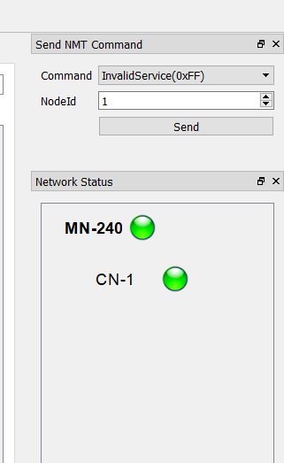

QT demo aplikacija MN čvora nam, između ostalog, omogućava prikaz procesnih podataka u okviru odgovarajućeg prozora prikazanog na sljedećoj slici.

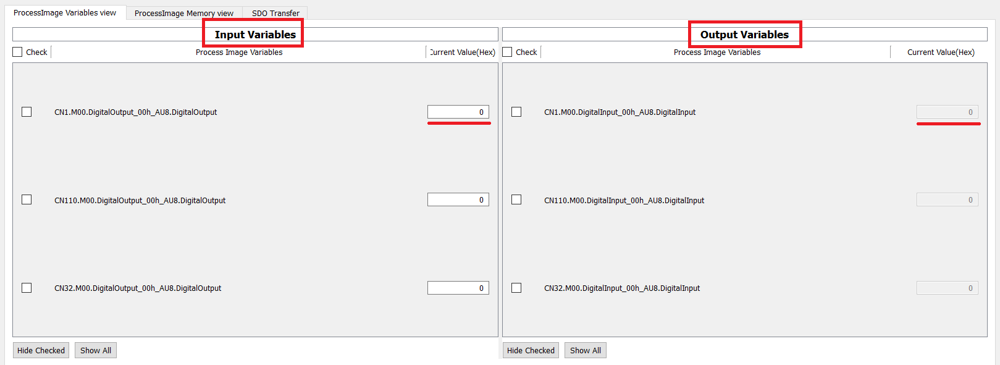

Kao što vidimo na slici, lijevo se nalaze ulazni procesni podaci MN čvora (izlazni procesni podaci CN čvorova), dok se desno nalaze izlazni procesni podaci MN čvora (ulazni procesni podaci CN čvorova). Podrazumijevana konfiguracija mreže očekuje procesne podatke od tri čvora, međutim, u našem slučaju su relevantna samo polja za čvor čija je adresa 1 (označeni na slici).

Ulazne procesne podatke u CN demo aplikaciji možemo da mijenjamo tasterima `i` (pomjeranje bitske jedinice udesno) i `d` (pomjeranje bitske jedinice ulijevo). Promjena se prikazuje u konzoli, npr. ako pritisnemo taster `i` tri puta, dobijamo

```sh
Digital inputs: -*------
Digital inputs: --*-----
Digital inputs: ---*----
```

Slično, ako nakon toga dva puta pritisnemo taster `d`, dobijamo sljedeće ispiseČ

```sh
Digital inputs: --*-----
Digital inputs: -*------
```

Ovo takođe možemo da verifikujemo i na MN strani (izlazni procesni podaci), kao što je ilustrovano na sljedećoj slici.

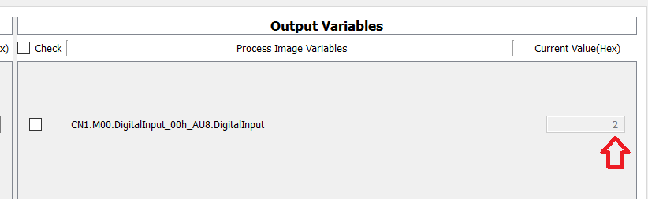

Digitalne izlaze na strani CN čvora (MN ulazni procesni podaci) moežmo da promijenimo na starni MN čvora kako je ilustrovano na slici ispod.

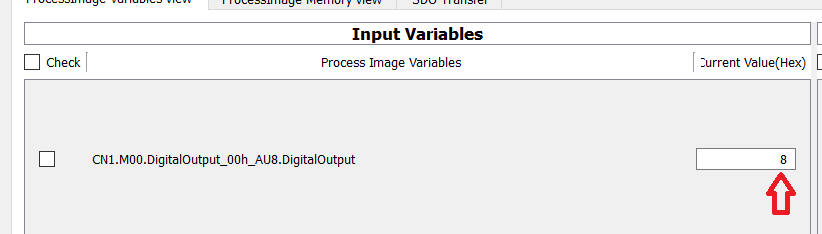

Naon što promijenimo ovu vrijednost, u konzoli na strani CN čvora možemo da prikažemo trenutno stanje izlaza pritiskom tastera `p` i na taj način verifikujemo da je promjena bila uspješna.

```sh
Digital outputs: ---*----
```

QT demo aplikacija MN čvora podržava i druge servise poput upravljanja stanjem čvorova (NMT servis definisan *CANopen* protokolom). Na primjer, ukoliko želimo da resetujemo čvor, to možemo da učinimo slanjem *ResetNode* NMT komande korišćenjem menija dostupnog u gornjem desnom dijelu prozora aplikacije (ilustrovano na slici ispod).

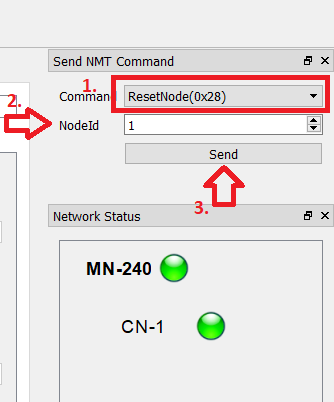

Sa slike vidimo da je prvo potrebno odabrati željenu NMT komandu, zatim definisati adresu čvora kojem želimo da pošaljemo ovu komandu i konačno kliknuti dugme *Send*. NMT komanda se šalje u sklopu asinhrone faze *Ethernet Powerlink* komunikacionog ciklusa (*Asnd* okvir koji slijedi nakon *SoA* okvira koji označava početak asinhrone faze). Ovo možemo da ispratimo ukoliko pokrenemo snimanje saobraćaja (npr. korišćenjem [*Wireshark* alata](https://www.wireshark.org/download.html)).

Kada čvor primi reset komandu, možemo da primjetimo da prelazi u stanje resetovanja, što se odražava i na prikazu trenutnog stanja u okviru QT demo aplikacije MN čvora.

Konačno, u sklopu asinhrone faze možemo da šaljemo i okvire kojima se prenose poruke u sklopu SDO servisa za prenos servisnih podataka (npr. prilikom konfiguracije parametara čvora). Ovo ćemo ilustrovati primjerom čitanja konfigurisane dužine komunikacionog ciklusa u mreži (parametar *NMT_CycleLen_U32* tipa *UNSIGNED32* koji se nalazi u riječniku objekata na indeksu 0x1006 i podindeksu 0x00). Da bismo poslali ovaj okvir, potrebno je u QT demo aplikaciji MN čvora da pređemo na karticu *SDO Transfer*, a zatim da definišemo neophodne parametre zahtijevanog SDO transfera i kliknemo dugme *Execute*. U desnom dijelu prozora vidimo status prenosa poruke kao što je ilustrovano na slici ispod.

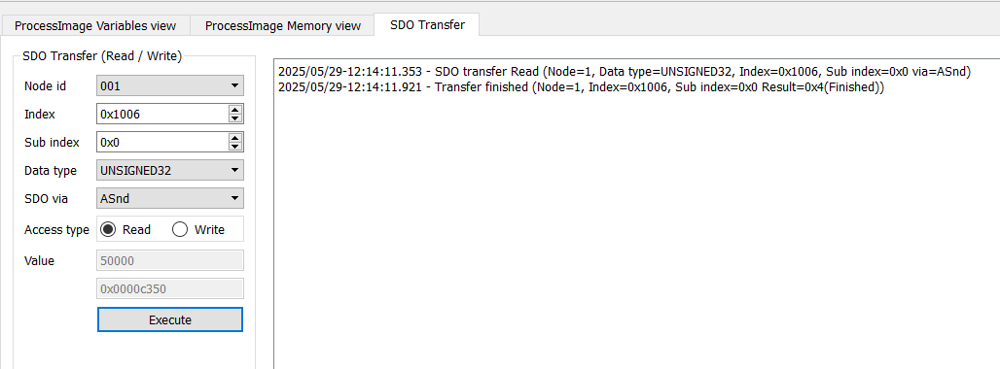

Nažalost, u ovom prozoru ne dobijamo vrijednost pročitanog podatka, već samo status transfera. Međutim, ako pokrenemo *Wireshark* sesiju i logujemo okvire, a onda filtriramo saobraćaj tako da prikažemo samo *ASnd* okvire, možemo da identifikujemo okvir koji prenosi naše podatke (vidjeti sljedeću sliku).

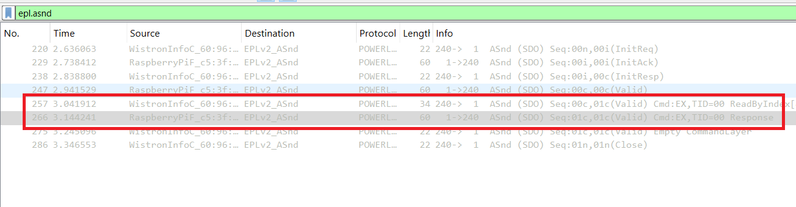

Konačno, ako pogledamo polje podataka (vidi sliku ispod), možemo da zaključimo da je trenutno podešena vrijednost za ovaj parametar 50000 (što odgovara vremenu ciklusa od 50ms). Ukoliko je potrebno, možemo promijeniti vrijeme ciklusa (npr. postaviti ga na 20ms) korišćenjem istog SDO servisa, s tim da je neophodno odabrati *Access type* tako da bude *Write*.

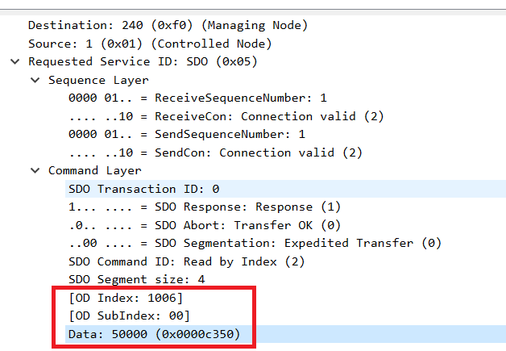

## Zadaci za samostalnu izradu ##

### Zadatak 1: Proširenje SOEM testne aplikacije ###
U zadatku je potrebno uraditi sljedeće:

1. Proširiti testnu *SOEM* aplikaciju tako da se omogući invertovanje bit jednog kanala digitalnog izlaza EL2002 uređaja periodično svake sekunde. Povezati digitalni izlaz sa digitalnim ulazom uređaja EL1012, a zatim pratiti promjenu stanja vrijednosti ulaznih podataka u procesnoj slici testne aplikacije.

### Zadatak 2: Konfiguracija složenije *Ethernet Powerlink* mreže ###
U zadatku je potrebno uraditi sljedeće:

1. Pročitajte, a zatim promijenite adresu CN čvora na 32 (umjesto podrazumijevane 1) korišćenjem SDO servisa (parametar *NodeID_U8* tipa *UNSIGNED8* u riječniku objekata na indeksu 0x1F93, podindeks 0x01). Kako se ova promjena manifestuje u ponašanju mreže? Kako se u ovom slučaju mijenjaju procesni podaci čvora?

2. Proširiti polaznu *Ethernet Powerlink* mrežu dodavanjem još dva CN čvora (sa adresama 32 i 110). Čvorovi trebaju da budu povezani sa MN čvorom preko *switch* ili *hub* uređaja. Eksperimentišite sa različitim vremenima ciklusa kako biste uočili promjene ponašanje mreže prilikom promjene vremena ciklusa.
